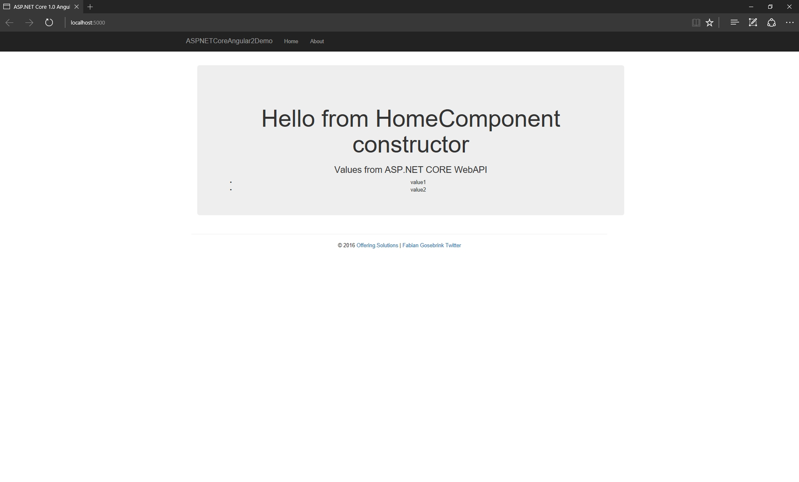
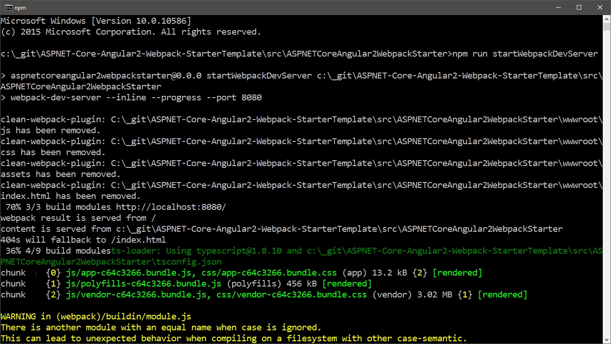
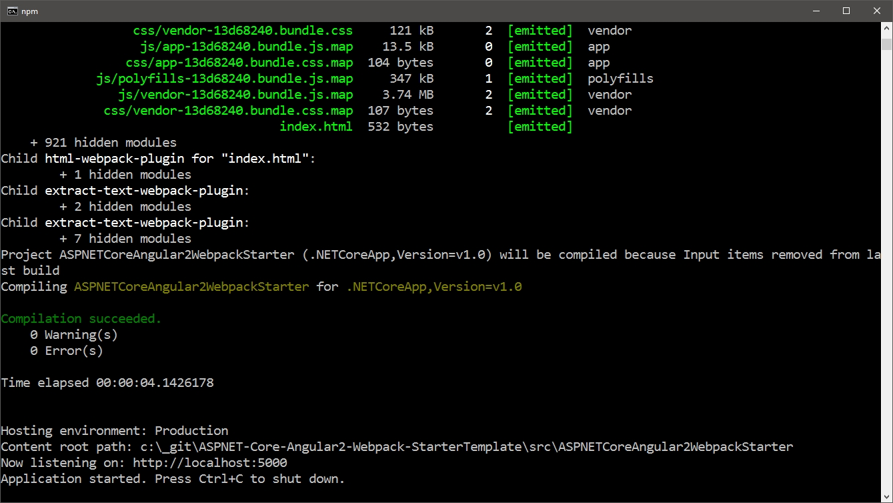

# Angular // Webpack 2 // ASP.NET CORE WebAPI Starter Template

This is a starter template for developing Angular with ASP.NET Core WebAPI Applications using webpack for bundling. It has the webpack dev server included as well as css styles in webpack, hashes for your files, automatic injection into the index.html etc.

## NPM Taskrunner

Make sure you have the npm Taskrunner installed

[NPM Task Runner](https://marketplace.visualstudio.com/items?itemName=MadsKristensen.NPMTaskRunner)

This template is an Angular application with an http-service getting values from an ASP.NET CORE WebAPI.

## Blogpost

[How to set up Angular and Webpack in Visual Studio with ASP.NET Core](http://offering.solutions/blog/articles/2016/08/27/how-to-set-up-angular-2-and-webpack-in-visual-studio-with-asp-net-core/)

## Start

Start by typing

`npm start`

at the level of the "package.json" file and browse to 

`localhost:5000`

### Option 2 (Frontend and backend running)

Now you can just press "play" inside Visual Studio to get started.

If you change the *.ts-files you need to run the `tsc` command manually.

### Option 3 (Only frontend is running)

`npm run startWebpackDevServer` will run the webpack dev server. After this you can browse to 

`localhost:8080`

and see the page working. You can do changes to the application and they will be automatically reflected in the browser.

### Option 4 (frontend and backend running)

You can type `npm run build` and browse to `localhost:5000` to see the page. This will trigger an webpack build and an `dotnet run`. Changes will not automatically appear in the browser.

